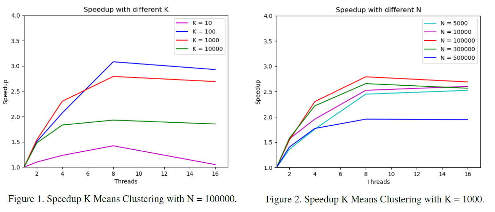

# K Means Clustering

An implementation of the K Means Clustering algorithm in C++ using OpenMP to achieve parallelization.

## Implementation

The core function `kMeansClustering()` accepts dataset of 2D points and uses the *Euclidean distance* to compute the assignments of each point to the clusters.

Two main classes are used by the function:

* Point: It has three members: `x` and `y` for the coordinates, and `clusterId` for the id of the cluster to which the point has been assigned. The class also has two constructors and the method `dist()` to compute the Euclidean distance between two points.

* Cluster: It has five members: an `id`, a Point for the current `centroid`, two fields to compute the partial sums of all points for each coordinate, `tempSumX` and `tempSumY`, and the `size` of the cluster. Aside from the constructor, the class has two main methods:
    * `addPoint()`: is used during the Assignment phase; it adds a point to the cluster by increasing the size counter and by adding its coordinates to the partial sums.
    * `updateCentroid()`: is used during the Update phase; it computes the new mean of the cluster.

The structure of `kMeansClustering()` is the following: it performs a random initialization of the clusters by choosing k points as initial centroids. In a do-while cycle bounded by the number of iterations to perform and a boolean `updateStopped`, the function alternates the assignment and update steps. In the assignment step, for each point we find the cluster with the closest centroid and then update the point’s `clusterId` and call the cluster’s method `addPoint()` to update the partial sums of the future centroid. The update step is limited to a simple for cycle over the clusters to call `updateCetroid()` to update all the centroids with the current points assignment. If the point's `clusterId` was updated the `updateStopped` is set to `false`.

Parallelization is obtained with a single `#pragma omp parallel for` over the assignment for loop and `#pragma omp atomic` on each line inside `addPoint()`.

## Speedup Results

